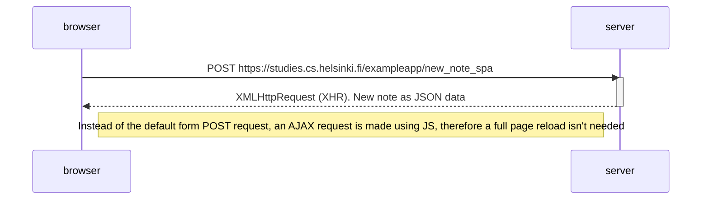

```mermaid
sequenceDiagram
  participant browser
  participant server

  browser->>server: POST https://studies.cs.helsinki.fi/exampleapp/new_note_spa
  activate server
  server-->>browser: XMLHttpRequest (XHR). New note as JSON data
  deactivate server

  Note right of browser: Instead of the default form POST request, an AJAX request is made using JS, therefore a full page reload isn't needed
```
